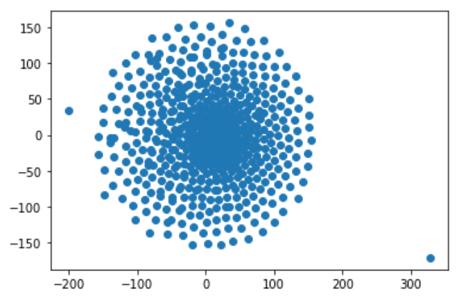
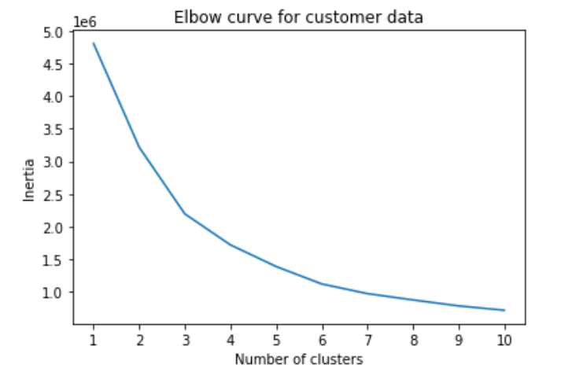

# Cryptocurrency Clusters

Dataset was obtained from [CryptoCompare](https://min-api.cryptocompare.com/data/all/coinlist).

* Filtered dataset and cleaned through Pandas.
    * Converted data into numerical values using dummy variables
    * Standardized dataset so columns that contain larger values do not unduly influence the outcome

### PCA Dimensionality Reduction
* Performed dimensionality reduction with PCA
    * Preserved 90% of the explained variance in dimensionality reduction
* Further reduced the dataset dimensions with t-SNE then created scatter plot of t-SNE output

### Cluster Analysis with k-Means
* Created an elbow plot to identify the best number of clusters.
* Used a for-loop to determine the inertia for each'k' between 1 through 10.

### Observations
When creating a scatter plot of the t-SNE output using the crypto data provided, it was observed
that there were no distinct clusters. Visually speaking, there was one large cluster, focusing
at the center of the plot and disspiating outwards.

When creating an elbow plot using the crypto data provided, it was observed that there was no distinct 'elbow' 
to the plot, resulting in no distinct value of 'k'. 

Based on the findings, it is recommendedd not to cluster cryptocurrencies together. There is no distinct correlation
between each one to which they can be grouped together.  

## References

Crypto Coin Comparison Ltd. (2020) Coin market capitalization lists of crypto currencies and prices. Retrieved from [https://www.cryptocompare.com/coins/list/all/USD/1](https://www.cryptocompare.com/coins/list/all/USD/1)

- - -
